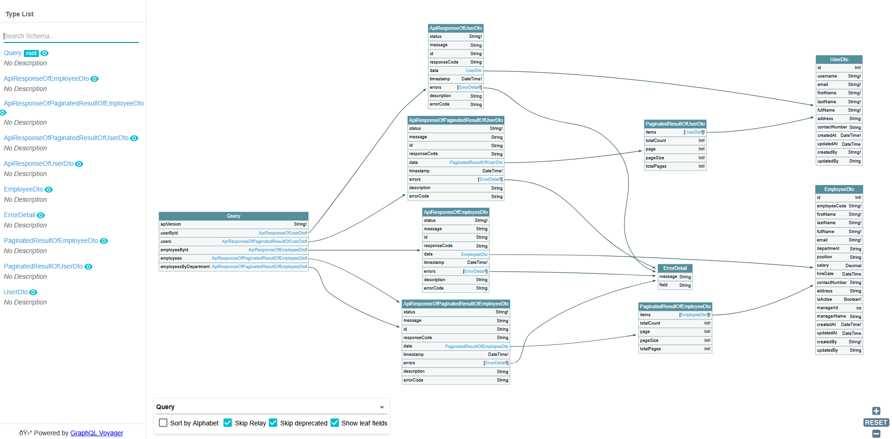
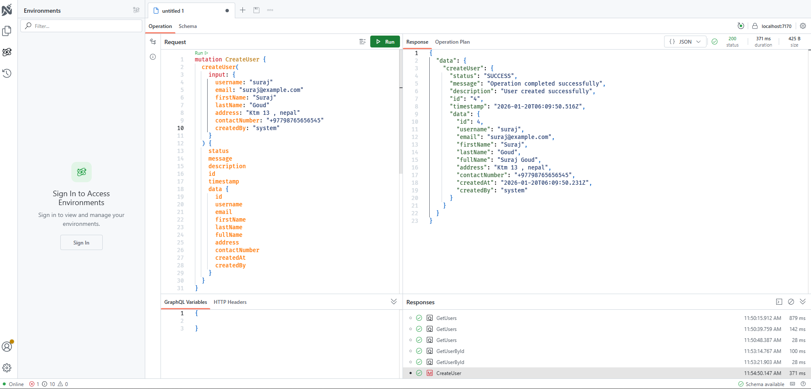

# ApiTypes
A collection of API code samples demonstrating GraphQL, gRPC, REST (cached &amp; uncached), and WebSocket implementations.

# GraphQL

---
> GraphQL is a **query-based API** that allows clients to fetch **exactly the required fields** in a **single request**, reducing **over-fetching**, **under-fetching**, and improving overall **performance**.
---

